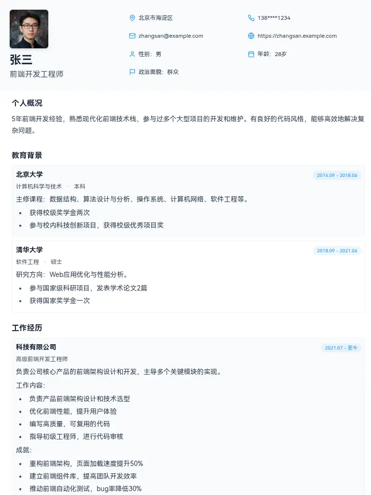
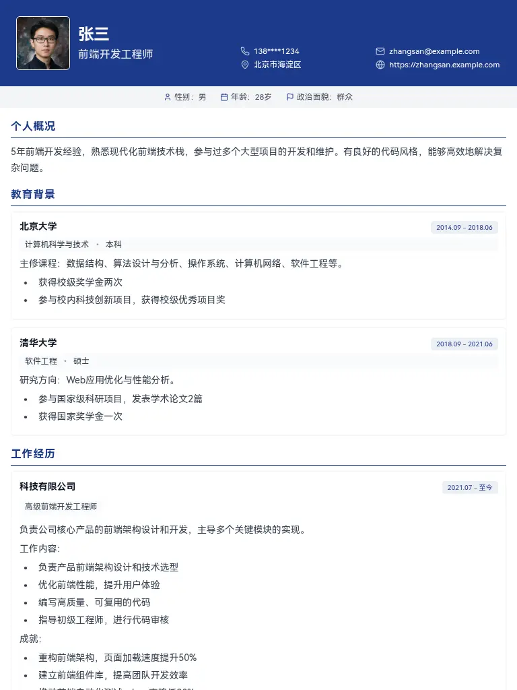
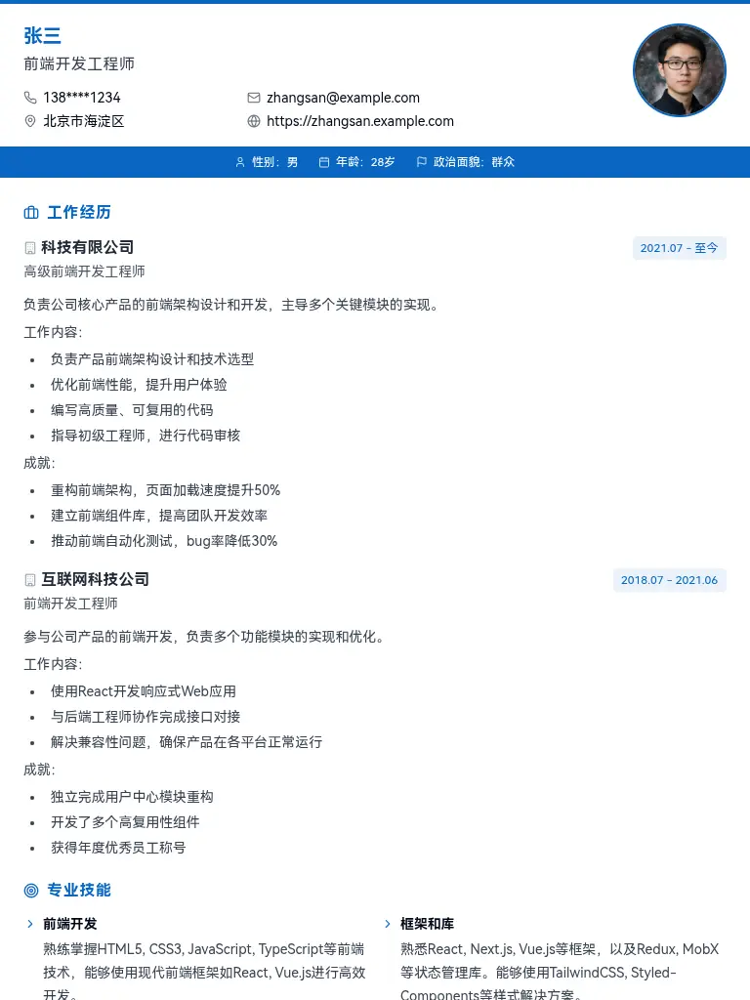
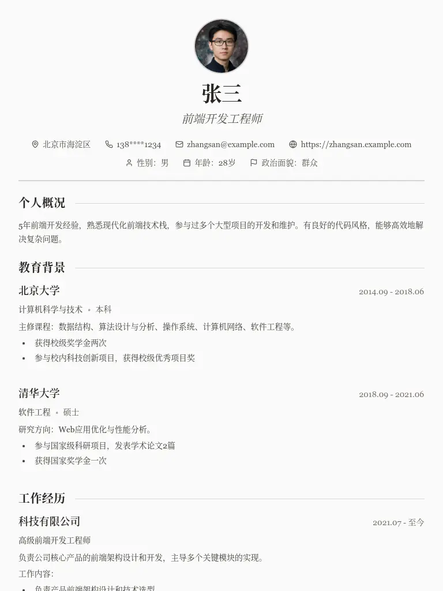
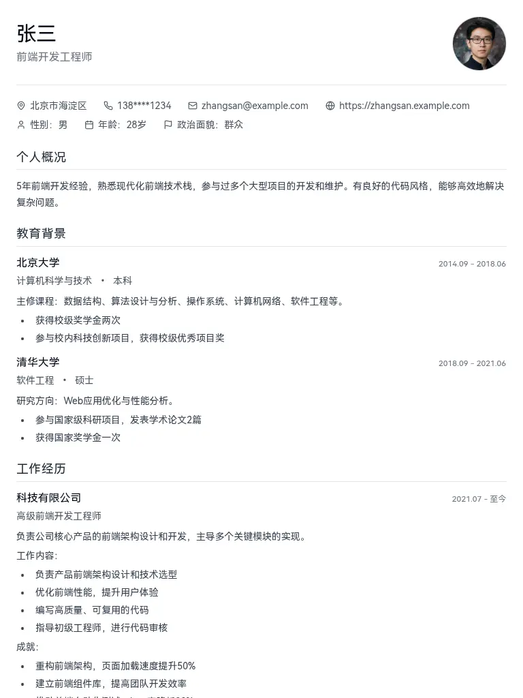
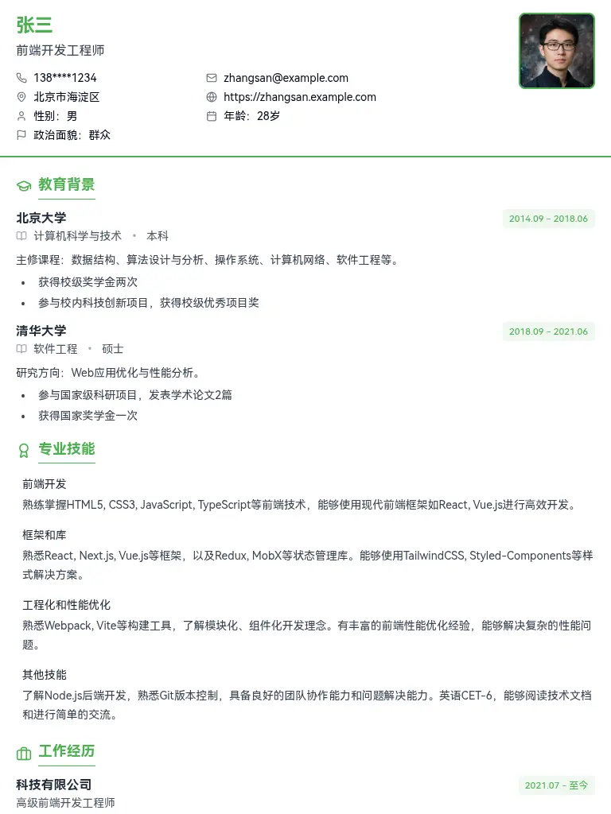
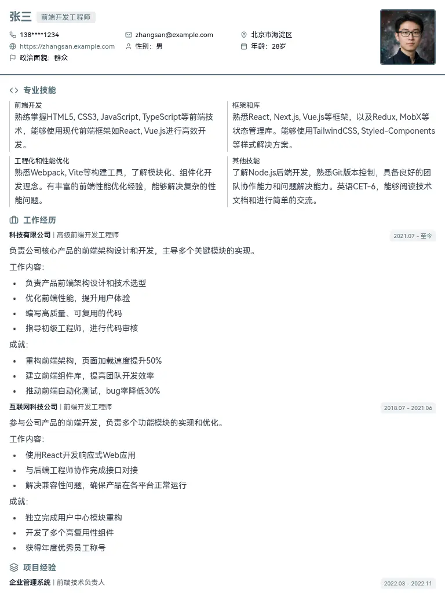
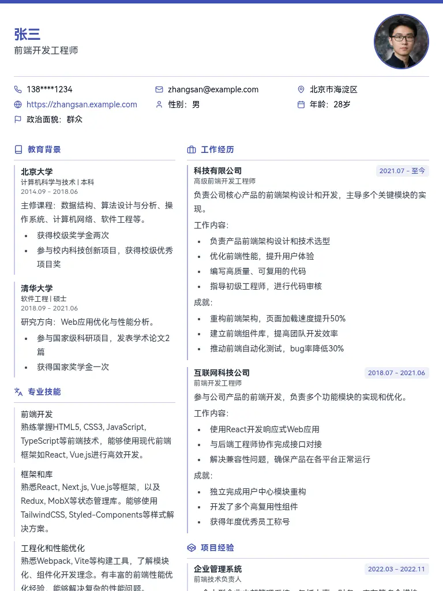
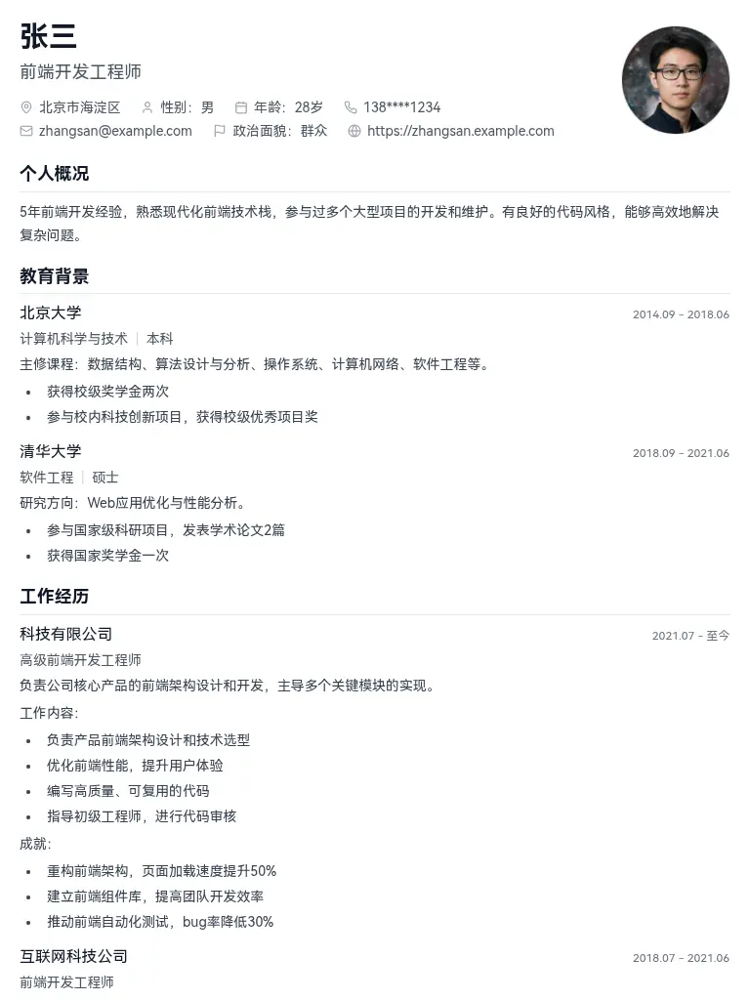

# LiteCV 简单简历

[](LICENSE)
[](https://preactjs.com/)
[](https://www.typescriptlang.org/)
[](https://vitejs.dev/)

> 🚀 **用 AI 轻松制作专业简历** - 内置多个精美模板，一键生成高质量简历

LiteCV 是一个简单现代的简历生成工具，让你可以使用 Cursor 等 AI 编程助手轻松创建和定制专业简历。基于 Preact + TypeScript + Vite 构建，默认支持 SSG（静态站点生成），速度极快。

## ✨ 核心特点

- 🎨 **9+ 精美模板** - 涵盖商务、极简、国际化等多种风格
- 🤖 **AI 友好** - 非常适合 AI 编程助手，如 Cursor 等
- ⚡ **极速加载** - 基于 Preact + SSG，加载超快
- 📱 **响应式设计** - 完美适配桌面端和移动端
- 🖨️ **一键导出** - 直接打印为 PDF，无需额外工具
- 🌍 **部署简单** - 支持 Vercel、Cloudflare Pages 等多平台一键部署
- 🎯 **TypeScript** - 完整的类型支持，开发体验极佳

## 🎭 模板预览

<table>
  <tr>
    <td align="center" width="33%">
      
      <br/>
      <strong>modern</strong>
      <br/>
      <em>现代简约，突出技能</em>
      <br/>
      适用：互联网从业者
    </td>
    <td align="center" width="33%">
      
      <br/>
      <strong>professional</strong>
      <br/>
      <em>商务正式，结构清晰</em>
      <br/>
      适用：传统行业
    </td>
    <td align="center" width="33%">
      
      <br/>
      <strong>business</strong>
      <br/>
      <em>商业范，重点突出成就</em>
      <br/>
      适用：商务人士
    </td>
  </tr>
  <tr>
    <td align="center" width="33%">
      
      <br/>
      <strong>elegant</strong>
      <br/>
      <em>优雅简洁，设计感强</em>
      <br/>
      适用：设计师/创意工作者
    </td>
    <td align="center" width="33%">
      
      <br/>
      <strong>minimal</strong>
      <br/>
      <em>纯净简约，信息密度高</em>
      <br/>
      适用：极简主义者
    </td>
    <td align="center" width="33%">
      
      <br/>
      <strong>fresh-grad</strong>
      <br/>
      <em>清新活力，突出教育背景</em>
      <br/>
      适用：应届毕业生
    </td>
  </tr>
  <tr>
    <td align="center" width="33%">
      
      <br/>
      <strong>senior-tech</strong>
      <br/>
      <em>技术导向，项目经验丰富</em>
      <br/>
      适用：资深技术人员
    </td>
    <td align="center" width="33%">
      
      <br/>
      <strong>international</strong>
      <br/>
      <em>国际化设计，英文友好</em>
      <br/>
      适用：海外求职
    </td>
    <td align="center" width="33%">
      
      <br/>
      <strong>next</strong>
      <br/>
      <em>前沿设计，科技感强</em>
      <br/>
      适用：现代化风格
    </td>
  </tr>
</table>

## 🚀 快速开始

### 1. 克隆项目

```bash
# 使用 Git 克隆
git clone https://github.com/wearzdk/lite-cv-ai.git
cd lite-cv-ai
```

### 2. 安装依赖

```bash
# 推荐使用 bun（速度更快）
bun install

# 或使用 npm/pnpm/yarn 等任何你方便的包管理器
npm install
```

### 3. 启动开发服务器

```bash
# 使用 bun
bun dev

# 或使用 npm
npm run dev
```

然后在浏览器打开 `http://localhost:5173` 即可看到默认简历。

### 4. 修改简历数据

编辑 `src/data/resume.ts` 文件，修改为你的个人信息：

```typescript
const resumeData: Resume = {
  base: {
    name: "你的姓名",
    job: "你的职位",
    location: "所在城市",
    phone: "手机号码",
    email: "邮箱地址",
    // ... 其他基本信息
  },
  blocks: [
    // 教育背景、工作经历、项目经验等模块
  ],
};
```

可以直接让 AI 帮你基于现有的简历修改。

### 5. 切换简历模板

编辑 `src/App.tsx` 文件，修改导入的模板：

```typescript
// 默认使用 next 模板
import Template from "./themes/next";

// 切换为其他模板，比如商务风格
// import Template from "./themes/business";
```

## 🎯 使用 AI 进行编写和优化

你可以借助 AI 工具来优化简历内容和样式：

- 使用 **Cursor、GitHub Copilot** 等 AI 编程助手编写或修改简历数据和模板
- 通过 **ChatGPT、Claude** 等 AI 助手优化简历内容，提升专业性和吸引力
- 可以尝试让 AI 帮你创建新的简历模板或调整现有模板的样式

## 📄 导出 PDF

在浏览器中右键打印，选择保存为 PDF 即可。

## 🌐 部署在线简历

你可以通过 AI 稍加改进，制作成自己的在线简历，并轻松部署到多个平台。
在开始前，先 Fork 这个仓库，然后再进行部署。

### 腾讯云 EdgeOne Pages

推荐使用，如果使用国内节点需有备案的域名。需要先 Fork 这个仓库，然后绑定 Github 账号并导入即可。

### Vercel 部署

或者直接在 [Vercel](https://vercel.com) 网站上导入 GitHub 仓库，按默认配置部署即可。

### Cloudflare Pages

直接在 [Cloudflare Pages](https://pages.cloudflare.com/) 网站上导入 GitHub 仓库，按默认配置部署即可。

### GitHub Pages

```bash
# 构建项目
npm run build
# 部署到 gh-pages 分支
npx gh-pages -d dist
```

然后在仓库设置中启用 GitHub Pages。

## 🛠️ 项目结构

```
lite-cv-ai/
├── src/
│   ├── data/
│   │   ├── resume.ts          # 简历数据配置
│   │   └── templates.ts       # 模板配置
│   ├── themes/               # 简历模板
│   │   ├── modern.tsx        # 现代风格
│   │   ├── professional.tsx  # 专业风格
│   │   ├── business.tsx      # 商务风格
│   │   └── ...               # 其他模板
│   ├── shared/               # 共享组件和工具
│   └── App.tsx              # 主应用组件
├── public/                  # 静态资源
└── dist/                   # 构建输出目录
```

## 🔧 高级定制

### 创建自定义模板

1. 在 `src/themes/` 目录下创建新的 `.tsx` 文件
2. 参考现有模板的结构进行开发
3. 在 `src/App.tsx` 中导入使用

### 修改样式系统

项目使用 UnoCSS 作为样式系统，你可以：

- 在组件中直接使用 Tailwind CSS 类名
- 在 `vite.config.ts` 中配置 UnoCSS 预设
- 添加自定义样式规则

### 扩展简历数据结构

在 `src/shared/resume.ts` 中修改 TypeScript 类型定义，添加新的字段或模块类型。

## 🤝 贡献指南

欢迎提交 Issue 和 Pull Request！如果你有新的简历模板想要分享，可以：

1. Fork 仓库
2. 添加你的模板到 `src/themes/` 目录
3. 提交 Pull Request

---

<div align="center">

**⭐ 如果这个项目对你有帮助，请给它一个 Star！⭐**

<!-- [](https://star-history.com/wearzdk/lite-cv-ai&Date) -->

</div>
